# Class Diagram

Ниже диаграмма классов для текущей структуры проекта `OnlineAPI`.

```mermaid
classDiagram
    direction LR

    namespace OnlineAPI {
        class AppContext {
            +DbSet~Project~ Projects
            +DbSet~Task~ Tasks
            +DbSet~User~ Users
            +DbSet~ProjectMember~ ProjectMembers
            +DbSet~Invitation~ Invitations
        }
    }

    namespace OnlineAPI.Entities {
        class User {
            +Guid Id
            +string Username
            +string Password
            +string? InvintaionCode
            +int? OwnedProjectID
        }

        class Project {
            +int Id
            +string Name
            +string Description
            +string OwnerId
            +DateTime CreatedDate
            +DateTime UpdatedDate
            +ICollection~Task~ Tasks
            +ICollection~ProjectMember~ Members
        }

        class Task {
            +int Id
            +string Title
            +string Description
            +TaskStatus Status
            +TaskPriority Priority
            +string[] Assignee
            +DateTime CreatedDate
            +DateTime? UpdatedDate
            +string? TaskCode
            +int ProjectId
        }

        class ProjectMember {
            +int Id
            +int ProjectId
            +string UserId
            +string UserName
            +ProjectRole Role
            +DateTime JoinedDate
            +Project Project
        }

        class Invitation {
            +int Id
            +string Code
            +bool IsUsed
        }

        class ProjectViewModel {
            +Project Project
            +ProjectRole UserRole
            +int TaskCount
            +int MemberCount
        }

        class ProjectDetailsViewModel {
            +Project Project
            +ProjectRole UserRole
            +List~Task~ Tasks
        }

        class ProjectSettingsViewModel {
            +int Id
            +string Name
            +string Description
            +bool IsOwner
            +bool CanEdit
            +List~ProjectMemberViewModel~ Members
        }

        class ProjectMemberViewModel {
            +string UserId
            +string UserName
            +string Role
            +bool IsCurrentUser
            +bool CanChangeRole
        }

        class UpdateProjectRequest {
            +int ProjectId
            +string Name
            +string Description
        }

        class UpdateMemberRoleRequest {
            +int ProjectId
            +string UserId
            +ProjectRole NewRole
        }

        class RemoveMemberRequest {
            +int ProjectId
            +string UserId
        }

        class TaskCreateViewModel {
            +string Title
            +string Description
            +TaskPriority Priority
            +int ProjectID
            +string SelectedUsersData
            +string[] SelectedUsers
        }

        class LoginViewModel {
            +string Username
            +string Password
            +bool RememberMe
        }

        class TaskMoveRequest {
            +int TaskId
            +TaskStatus NewStatus
        }

        class ProjectRole {
            <<enumeration>>
            Owner
            Admin
            Member
            Viewer
        }

        class TaskStatus {
            <<enumeration>>
            ToDo
            InProgress
            Review
            Done
        }

        class TaskPriority {
            <<enumeration>>
            Low
            Medium
            High
        }
    }

    namespace OnlineAPI.Controllers {
        class AuthController
        class ProjectsController
        class TasksController
        class ProjectSettingsController
        class ReportsController
        class SuperAdminController
    }

    AppContext --> Project
    AppContext --> Task
    AppContext --> User
    AppContext --> ProjectMember
    AppContext --> Invitation

    Project "1" *-- "0..*" Task : contains
    Project "1" *-- "0..*" ProjectMember : includes
    ProjectMember --> Project : navigation

    Project --> ProjectRole : owner/member role logic
    Task --> TaskStatus
    Task --> TaskPriority
    TaskMoveRequest --> TaskStatus

    ProjectViewModel --> Project
    ProjectViewModel --> ProjectRole
    ProjectDetailsViewModel --> Project
    ProjectDetailsViewModel --> Task
    ProjectDetailsViewModel --> ProjectRole
    ProjectSettingsViewModel --> ProjectMemberViewModel
    UpdateMemberRoleRequest --> ProjectRole
    TaskCreateViewModel --> TaskPriority

    AuthController --> AppContext
    AuthController --> LoginViewModel
    AuthController --> User
    AuthController --> Invitation

    ProjectsController --> AppContext
    ProjectsController --> Project
    ProjectsController --> ProjectMember
    ProjectsController --> ProjectViewModel
    ProjectsController --> ProjectDetailsViewModel

    TasksController --> AppContext
    TasksController --> Task
    TasksController --> TaskCreateViewModel
    TasksController --> TaskMoveRequest

    ProjectSettingsController --> AppContext
    ProjectSettingsController --> ProjectSettingsViewModel
    ProjectSettingsController --> UpdateProjectRequest
    ProjectSettingsController --> UpdateMemberRoleRequest
    ProjectSettingsController --> RemoveMemberRequest

    ReportsController --> AppContext
    ReportsController --> Task
    ReportsController --> ProjectMember

    SuperAdminController --> AppContext
    SuperAdminController --> User
    SuperAdminController --> Invitation
```

Примечания:

- Диаграмма построена по текущему коду и отражает фактические зависимости, а не идеальную доменную модель.
- Связь `ProjectMember -> User` в коде хранится через `UserId`/`UserName`, без навигационного свойства EF.
- Поле `Project.OwnerId` тоже хранит ссылку на пользователя как `string`, без отдельной навигации на `User`.
